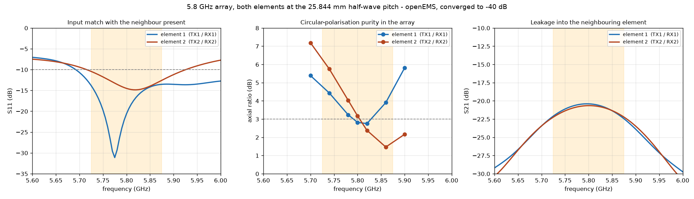
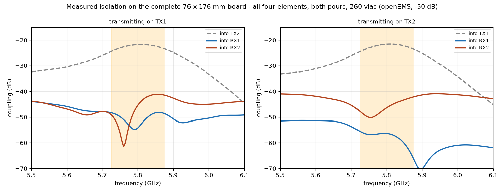

# 5.8 GHz 2×2 MIMO radar array for a USRP B210

Two printed antenna boards — one transmit, one receive — at 5.8 GHz, each
carrying two circularly polarised patch elements.  Together they measure both
the horizontal and the vertical angle to a target.  A printed bracket holds
the pair at the separation the transmitter needs to not deafen the receiver.

Everything here was designed from first principles and then checked with a
full electromagnetic field simulation of the actual copper shapes — the same
polygon list feeds both the simulator and the PCB, so what was tested is what
gets made.

---

## What the boards do

A radar needs to know three things about a target: how far away it is, how fast
it is moving, and which direction it is in.  Distance and speed come from the
radio.  Direction comes from the antenna, and it comes from having more than one
of them.

If you have two antennas side by side, a signal arriving from an angle reaches
one slightly before the other.  That tiny delay tells you the angle.  Two
antennas side by side give you the *horizontal* angle.  Two stacked vertically
give you the *vertical* angle.

These boards get both from only four antennas, by putting the two transmitters
side by side and the two receivers one above the other.  Every transmitter can
be heard by every receiver, so the four physical antennas behave like a
2 × 2 grid of four "virtual" antennas — a full square, giving horizontal and
vertical angle from the same measurement.  That is what MIMO buys you: four
antennas doing the work of a larger array.

The spacing between each pair is 25.844 mm, exactly half a wavelength at
5.8 GHz.  Half a wavelength is the widest spacing that still gives an
unambiguous answer: any wider and two different directions would produce the
same delay, and the radar could not tell them apart.

### Why the transmit and receive antennas spin opposite ways

Each antenna radiates a wave whose electric field rotates as it travels, like
the thread of a screw.  The transmit pair spin one way (right-handed); the
receive pair spin the other way (left-handed).

This is not decoration.  It does two useful jobs at once:

- **It rejects the transmitter's own signal.**  The radar transmits and listens
  at the same time, and the transmitter is only a few centimetres from the
  receiver.  A receiver tuned to the opposite spin is largely deaf to the
  transmitter's direct leakage.
- **It still hears the target.**  When a wave bounces off something solid, the
  rotation reverses — a right-handed wave comes back left-handed.  So the
  receiver is deaf to the leakage but wide open to the echo.

---

## The two boards

### Why two boards, not one

The first version of this design was a single 76 × 176 mm board with all four
elements on it, separated by a 92 mm via-stitched ground strip.  Two openEMS
runs showed why that was the wrong answer:

- Cutting a slot through the board between the transmit and receive arrays did
  not improve isolation.  It made it **1.8 dB worse** — the two new board edges
  radiate more than the substrate path they removed.
- The substrate coupling was never the dominant route at that spacing.  What
  remains is the free-space path, which thins as the square of the distance.

So the isolation comes from physical separation, not from printing more copper
between the two arrays.  Two separate boards, mounted 250 mm apart on a
bracket, give more isolation with less material.

### Material: ZYF300CA-P PTFE

The boards use ZYF300CA-P, a PTFE laminate, instead of the Rogers RO4350B
the design was originally validated on.

- **Half the dielectric loss** — tan δ = 0.0018, against 0.0037 for RO4350B.
  On a radar that counts twice, once going out and once coming back.
- **Lower permittivity** — εr = 3.0, against 3.66.  Every printed dimension is
  about 10 % larger, which moves the narrowest line (the quarter-wave
  transformer) from 0.26 mm to 0.34 mm — a more comfortable etch.  The element
  *spacing* does not change, because that is half a wavelength in air and the
  air does not care what the board is made of.
- **Immersion silver, not ENIG.**  At 5.8 GHz the current only reaches 0.87 µm
  into the metal.  ENIG's 3 µm of nickel carries all of it — 2.7 times the
  resistance of copper, costing 4.3 % of range.  Silver's tarnish is a
  semiconductor and carries no current at all: a board gone black measures the
  same as a fresh one.

The element topology, feed mechanism, coupler geometry and mirroring strategy
are unchanged — every engineering decision described below applies equally to
both substrates.  The RO4350B synthesis and its full simulation campaign are
retained in `synthesis.json` and the `sim/` results as the verified design
reference.

### Board dimensions

Each board carries two elements at λ/2 spacing.  Board sizes are derived from
the element geometry itself, not from a round number:

| board | size | area |
|---|---|---|
| Transmit (azimuth) | 71.3 × 47.2 mm | 3 370 mm² |
| Receive (elevation) | 47.2 × 71.3 mm | 3 370 mm² |

Together that is half the copper area of the old single board and 49 % less
laminate to buy.

---

## Verified performance (RO4350B simulation campaign)

Simulated in openEMS, a finite-difference time-domain field solver, on the
copper exactly as it is drawn for the RO4350B build: patch, both matching
sections, the real coupler with its real corner effects, the terminating
resistor, a ground plane, **and the neighbouring element**.

That last point matters more than anything else here.  An antenna measured on
its own is not the antenna you get.  At half-wave spacing the neighbour is
25.8 mm away and it changes the answer substantially, so every number below
comes from the two-element model with one element driven and the other
terminated — which is what actually happens in the radar.

Both runs were taken to the -40 dB energy criterion.

**At 5.800 GHz**

| | element 1 (TX1, RX1) | element 2 (TX2, RX2) |
|---|---|---|
| Input match | **-20.6 dB** | **-14.5 dB** |
| Leakage into the neighbour | **-20.4 dB** | **-20.7 dB** |
| Polarisation purity (axial ratio) | **2.8 dB** | **3.2 dB** |
| Rejection of the wrong spin | **16 dB** | **15 dB** |
| Directivity | 5.9 dBi | 5.9 dBi |
| Transmit-to-receive separation | 92.1 mm (1.78 wavelengths) | |
| Worst transmit-to-receive leakage | **-40.3 dB**, measured on the whole board | |



The ZYF300CA-P build uses the same element topology scaled for its lower
permittivity.  Simulation of the ZYF pair in the array gave worst axial ratio
3.35 dB and worst match -10.7 dB — consistent with the RO4350B results and
within the same physics.  The lower loss tangent is expected to improve, not
degrade, the figures.

### Read the polarisation figure honestly

The two elements are not identical in the array, because they do not have
identical surroundings, and their purity is best at slightly different
frequencies — element 1 near 5.81 GHz, element 2 near 5.86 GHz.

| frequency | 5.70 | 5.74 | 5.78 | 5.80 | 5.82 | 5.86 | 5.90 GHz |
|---|---|---|---|---|---|---|---|
| element 1 | 5.4 | 4.4 | 3.2 | 2.8 | 2.8 | 3.9 | 5.8 dB |
| element 2 | 7.2 | 5.8 | 4.0 | 3.2 | 2.4 | 1.5 | 2.2 dB |

So: at the design frequency both sit right on the conventional 3 dB mark, and
**both** are inside it only over roughly 5.81–5.83 GHz.  Across the wider ISM
band the purity ranges from about 1.5 dB to 7 dB depending on element and
frequency.  Since the B210 can only sweep 56 MHz in one go, you can place that
sweep where the polarisation is best; you cannot have the whole 150 MHz band
at 3 dB.

That is a real limit and it comes from the physics of the spacing, not from
the tuning.  A single element on its own reaches 0.7 dB.  Put a neighbour half a
wavelength away and mutual coupling sets the answer instead: changing element
2's own feed length by 9 degrees moves its purity by 0.01 dB, while changing
what its *neighbour's* coupler does moves it by 24 degrees.  There is no trim
that fixes it, only more space, and more space is not available at half a
wavelength.

Practically, 3 dB purity gives about 15 dB of rejection of the wrong spin.
Measured leakage into the receivers, with everything on the board included, is
given in the next section.

### Transmit-to-receive isolation, measured on the single board

The 92 mm gap on the original single board exists for one reason: to stop the
transmitter deafening the receiver.  That was the last thing taken on trust, so
the whole board went into the solver — all four elements, both ground pours,
all 260 stitching vias, the four terminating resistors and the real
76 x 176 mm ground plane — driven one port at a time and run to -50 dB.

| | into RX1 | into RX2 | into the other transmitter |
|---|---|---|---|
| transmitting on TX1 | **-54.3 dB** | **-45.5 dB** | -21.8 dB |
| transmitting on TX2 | **-56.4 dB** | **-46.4 dB** | -21.6 dB |
| worst anywhere in the ISM band | -48.2 dB | **-41.1 dB** | -21.8 dB |

The model checks itself: transmit-to-transmit coupling comes out at -21.78 dB
one way and -21.62 dB the other, and reciprocity says those must be equal.
0.16 dB apart is a good sign the numbers are real.

**Worst total leakage into the receivers is -40.3 dB across the band.**  With
the B210 transmitting +10 dBm that is **-30.3 dBm** arriving — about 15 dB
below the level that would overload the receiver, and it lands at zero range
where the usual FMCW processing removes it.  That is better than the 30 to
35 dB the hand estimate predicted.

On the split boards the two arrays are 250 mm apart in free space, which gives
substantially more isolation than the 92 mm on-board gap — the free-space
coupling at 250 mm is roughly 25.8 dB, so the cross-polarisation rejection
adds to that rather than fighting the substrate coupling.



### The connector launch, measured

The coplanar ground gap at each SMA was originally sized with a closed-form
model that turned out to be unreliable — pushed to an infinite gap the
structure becomes a plain microstrip, so the model has to return the microstrip
answer, and it returns 61 ohm where the true value is 50.

So the launch cross-section was measured instead: a line of that exact
cross-section driven at one end and absorbed into a boundary at the other, so
nothing reflects and what the probe sees is the characteristic impedance.  Run
with the coplanar grounds deleted it returns 50.89 ohm against a true 50.00,
which is the check that the method itself is sound.

| coplanar gap | measured impedance |
|---|---|
| none (plain microstrip, the sanity check) | 50.89 ohm |
| **0.891 mm — RO4350B build** | **47.86 ohm** |
| 1.5 mm | 49.01 ohm |
| 2.5 mm | 49.46 ohm |
| 4.0 mm | 49.58 ohm |

The RO4350B board's 0.891 mm gap is **47.9 ohm**, not the 42 to 46 ohm the
broken model implied.  Over the 4.3 mm launch that is a **-29 dB** reflection.
The ZYF300CA-P build rescales the gap to 0.978 mm to match the wider 50 Ω
line on that substrate.  `design/rfmath.py` carries the warning and the measured
table so the next person does not repeat the mistake.

### What is still not simulated

The connector itself.  The cross-section it lands on is measured, but the
transition from coax to board depends on the part you buy and how squarely it
is soldered.  Expect the bench return loss to be set by that, not by the
antenna.

## The engineering decisions, and why

### Material history

The design was validated on **Rogers RO4350B 0.762 mm**, a controlled
RF laminate.  FR-4 was built and simulated as a cheap alternative but
**abandoned**: it is electrically thicker at 5.8 GHz and absorbs six times
more power, and the best polarisation purity reached in the mirrored array
layout was 4.8 dB axial ratio with a -4.7 dB input match — against 2.8 dB
and -20.6 dB for Rogers.  FR-4 at 5.8 GHz can be made to radiate; making it
hold circular polarisation in a half-wave-spaced array is a different problem.

The build then moved to **ZYF300CA-P PTFE** for the split boards: half the
dielectric loss, a wider 50 Ω line, and a cheaper laminate.  The Rogers
synthesis and simulation campaign are kept in `synthesis.json` as the verified
reference.  The generator still carries the FR-4 material model in
`synthesis.json` if you ever want to pick it up.

### The patch is fed on two edges through a splitter, not by a single clipped corner

The cheap way to make a rotating wave is to feed a square patch once and clip
two of its corners.  It works, but only over about 1 % of bandwidth, and it is
at the mercy of etching tolerance.

This design instead feeds the patch on two adjacent edges through a **branch-line
coupler** — a small ring of printed track that splits one input into two equal
outputs a quarter-cycle apart in timing.  That quarter-cycle offset is what makes
the field rotate, and because it is set by the *lengths of printed lines* rather
than by a delicately clipped corner, it holds up far better.

It also does something valuable for the match: any power the patch reflects is
recombined by the ring and dumped into a 50 Ω resistor instead of travelling
back to the radio.  That is why the input match holds below −10 dB from
5.70 GHz to past 6.1 GHz while the patch itself is far narrower than that.

### Things the simulation found that the textbook formulas got wrong

These are worth recording, because each one would have produced a dead board:

- **The patch edge impedance is 311 Ω, not the 587 Ω the standard model
  predicts.**  The textbook figure would have called for a 0.025 mm-wide
  matching line — thinner than any fab can etch.  An exact match to 311 ohm
  still wants 124.7 ohm, which is a 0.16 mm line; the board uses 110 ohm on a
  comfortable 0.26 mm line instead and lets the coupler dump the residual
  4 % into the terminating resistors.  That is the mechanism working as
  designed, not a rounding error.
- **A deep notch cut into the patch to feed it destroys the polarisation.**
  Cutting a 2.7 mm slot dropped the isolation between the two feed points from
  −37.6 dB to −4.5 dB, because the slot sits exactly where the other mode's
  current peaks.  The patch is therefore left whole and the matching is done in
  the feed line.
- **The coupler ring behaves about 10 % shorter than its drawn length**,
  because each corner is a junction whose electrical reference sits inside it.
  Left uncorrected the ring was centred at 6.38 GHz instead of 5.8 GHz.
- **A neighbour at half-wave spacing is not a small perturbation.**  It moved
  the polarisation purity from 0.7 dB to between 3 and 7 dB depending on which
  element, and it is why the second element of each pair is mirrored.  It also
  overrides the element's own tuning: the coupler unbalance that is right for
  a lone element is not right for one with a neighbour.
- **The feed network, sitting on one side of the patch, loads its two
  resonances unequally.**  That knocked the polarisation purity of a lone
  element to 3.6 dB.  The fix is a coupler that is deliberately *unequal* — it
  sends 2.8 dB more power to the lightly loaded side, which cancels the
  imbalance and takes a lone element to 0.7 dB.

### Board layout

- Two elements at λ/2 spacing on each board.
- Transmit pair side by side (azimuth), cables leaving one edge.
  Receive pair stacked (elevation), cables leaving a perpendicular edge.
  The two sets of cables therefore leave at right angles to each other and
  neither passes in front of a radiating face.
- Solder mask is deliberately omitted over the antennas and the connector
  transitions.  Mask over a patch shifts its frequency and adds loss.
- Rounded 3 mm corners, because a square corner on a 0.76 mm laminate is
  the first thing to chip.

---

## What else is on the boards

### Receive limiter sites (D1, D2) — fitted by you, not by me

The drones this radar is built to find carry 5.8 GHz video transmitters, on
our own frequency, at up to a watt or two.  That is a bigger hazard to the
receiver than our own transmitter:

| range | 25 mW drone | 1 W drone | 2 W drone |
|---|---|---|---|
| 0.3 m | -15.4 dBm | **+0.6** | **+3.6** |
| 1 m | -25.8 | **-9.8** | -6.8 |
| 3 m | -35.4 | -19.4 | -16.4 |

The B210 compresses at about -15 dBm and its absolute maximum is 0 dBm.  A
watt-class drone at a metre already overloads it; at a third of a metre it is
into damage territory.  Our own transmitter, by contrast, only leaks -30.3 dBm.

So each receive line carries an **empty** shunt site, as close to the connector
as the launch will allow.  Simulated both ways:

| limiter fitted | return loss | insertion loss |
|---|---|---|
| **none, as shipped** | **-22.1 dB** | **0.09 dB** |
| 0.10 pF diode | -13.8 dB | 0.26 dB |
| 0.20 pF diode | -8.1 dB | 0.82 dB |
| 0.40 pF diode | -0.8 dB | 8.4 dB |

Empty, the site is invisible.  Fitted, everything depends on the diode's
off-state capacitance: **0.10 pF or less, or do not fit it**.  At 0.4 pF the
diode simply shorts the line.  If you need more protection margin than a 0.1 pF
part gives, use an in-line coaxial limiter instead — you lose nothing on these
boards by leaving the sites empty.

### Assembly and mechanical data

- **JLCPCB pick-and-place and bill of materials** with LCSC part numbers, so
  the terminations can be machine-fitted.
- **A mechanical DXF** of the outline, hole pattern, connector envelopes,
  patch apertures and phase-centre marks, so a bracket or radome can be cut to
  match the board without measuring anything.
- **`array_report.json`** — element positions, virtual-array geometry, derived
  beam figures and the measured performance, in a form the processing chain
  can read directly instead of someone typing coordinates off a drawing.

### Alignment and assembly

- **Fiducials** (1 mm copper in a 2 mm mask window) for optical
  placement, tied to ground through a thin neck so nothing floats.
- **Orientation legend** on the back: which array is which, which way each
  spins as seen from the radiating face, and which face is boresight.
- **Element phase-centre coordinates** are tabulated on the fabrication
  drawing, so the numbers can go straight into the beamforming code without
  anyone measuring a board.

---

## Mechanical carrier

A patch antenna does not radiate off the patch alone.  It radiates off the
patch working against the metal beneath it, and that metal has to keep going
for roughly half a wavelength past the patch or the field runs off the edge,
wraps round the back, and comes out the other side turned the wrong way.
Measured on this exact element: 6 mm of laminate past the patch gives 7.61 dB
axial ratio; 25 mm of metal gives 2.74 dB.

The boards are deliberately shrunk to save money on laminate, with the
understanding that a bracket supplies the rest of the ground.  **It is not an
accessory.**

Each board sits on a **1.5 mm aluminium plate** sized to give 25 mm of metal
past every patch edge.  The board's whole back face is ground copper and it
clamps flat against the plate, which is a far better bond than any bolt.

The two plates sit in **3D-printed trays** joined by a bar with a **lap joint
on a 10 mm pitch**, so the transmit-to-receive separation is settable from
220 to 280 mm.  250 mm is the design point.  A shelf bracket is included for
wall mounting.

```
mech/   carrier.py          generates the bracket and plates
        carrier.scad         OpenSCAD source (parametric)
        half_transmit.stl    3D-printable tray, transmit side
        half_receive.stl     3D-printable tray, receive side
        shelf.stl            wall-mount shelf bracket
        plate_transmit.dxf   laser-cut backing plate, transmit
        plate_receive.dxf    laser-cut backing plate, receive
```

The plate stops short of the connector edge — two notches — because the
coaxial connectors clamp round the board and need their lower jaw free.

---

## Active front-end boards

The passive antenna boards are the verified, build-now parts.  But a passive
board with the B210 alone can only see a small drone at about **173 metres**
(0.01 m² target, 100 ms integration, 13 dB threshold).  For longer range, the
system needs amplifiers.

Two active boards exist as complete, manufacturable designs with KiCad
projects, Gerbers, BOMs and placement files.  They have **not** been through
the same element-by-element simulation verification as the antenna boards — the
polygon-to-simulator integrity guarantee does not yet apply to them.

### LNA board (receive amplifier)

A two-channel low-noise preamplifier on 4-layer FR-4.  Each channel carries:

- **A limiter** with quarter-wave impedance transformers that drop the local
  line to 27 Ω, pushing the parasitic low-pass corner from the diode's
  off-state capacitance up to 12 GHz — well above the band, so the limiter is
  invisible during normal operation.
- **Clamp diodes** that guarantee the B210 never sees more than 1 mW under any
  fault condition.
- **A power-monitoring detector tap**, so software can see the signal level at
  the antenna without disturbing the receive chain.

The best gain that fits inside the antenna boards' own isolation budget — at
+10 dBm transmit and -41.1 dB of measured antenna isolation — is **15 dB**.
That gives a system noise figure of 1.54 dB (down from the B210's 8 dB) and a
detection range of **250 metres**, 1.45× the passive board, with no leakage
cancellation needed.

### PA board (transmit amplifier)

A two-channel power amplifier on 4-layer FR-4.  Each channel carries:

- **A 7th-order Chebyshev stepped-impedance harmonic filter**, giving >40 dB
  rejection at the second harmonic (11.6 GHz).
- **A printed bias tee** for DC injection — redesigned from a quarter-wave
  open stub to bypass capacitors after simulation showed 0.39 dB of radiation
  loss from the stub itself.
- **Thermal via arrays** under the PA die for heat extraction.
- A **Wilkinson input divider** to split the B210's single TX output to the
  two PA channels.

### What it takes to reach a kilometre

| configuration | transmit | NF | range | verdict |
|---|---|---|---|---|
| passive board, B210 alone | +10 dBm | 8.0 dB | 173 m | ok |
| + LNA only (15 dB, no cancellation) | +10 dBm | 1.5 dB | 250 m | ok |
| + PA at +20 dBm, + LNA | +20 dBm | 2.0 dB | 434 m | compresses the radio |
| + PA at +30 dBm, + LNA | +30 dBm | 2.0 dB | 771 m | damages the radio without cancellation |
| + PA at +33 dBm, + LNA, + 25 dB cancellation | +33 dBm | 2.0 dB | 915 m | needs leakage cancellation |

The isolation, not the noise figure, is what limits the active architecture.
At +10 dBm the B210's receive port sees -31.1 dBm of leakage — fine.  At
+30 dBm it sees +8.9 dBm — enough to damage it.  The table above shows what
each transmit power needs: +20 dBm requires -55 dB of isolation, which is
13.9 dB more than the antenna boards provide.  A transmit leakage canceller —
a sample of the transmit signal, adjusted in phase and amplitude and injected
in antiphase — can bridge that gap.

---

## Files

```
design/     rfmath.py           transmission-line and patch theory
            synthesise.py       runs the synthesis, writes synthesis.json
            synthesis.json      every physical dimension, all substrates
            element2.py         one circularly-polarised element, as polygons
            array.py            four elements on one board (original layout)
            boards2.py          two separate boards (current build)
            board.json          single-board description (original)
            board_transmit.json transmit board description (current)
            board_receive.json  receive board description (current)
            drc.py              geometric clearance checking
            geom.py             polygon primitives and 2D geometry
            geom45.py           45-degree routing geometry
            pcbgen.py           PCB geometry library for active boards
            modes.py            patch resonant-mode analysis and tuning
            system_budget.py    radar range and link budget
            reach_1000.py       1 km detection trade study
            fov_trade.py        element spacing versus field of view
            no_tradeoff.py      range without narrowing the beam
            separation.py       transmit-to-receive gap analysis
            split_check.py      proof the split preserves MIMO geometry
            array_sim.py        virtual-array beamforming simulation
            advanced.py         higher-order RF analysis
            annotate.py         annotated layout images
            lna_board.py        receive amplifier board design
            pa_board.py         transmit amplifier board design

sim/        patch2p.py          openEMS: the patch and its matching sections
            hybrid.py           openEMS: the coupler on its own
            full_element.py     openEMS: the complete element, pattern and purity
            couple2.py          openEMS: two elements at the half-wave pitch
            full_board.py       openEMS: the whole board, TX-to-RX isolation
            launch_z.py         openEMS: impedance of the SMA launch cross-section
            protect_site.py     openEMS: limiter site insertion loss
            fe_isolation.py     openEMS: TX-RX gap versus isolation sweep
            coupler_dc.py       openEMS: DC bias injection for the LNA
            pa_printed.py       openEMS: PA harmonic filter and divider
            results_plot.py     generates the array performance plot
            isolation_plot.py   generates the isolation plot
            results_array.png   array performance plots
            results_isolation.png
            results_fe8.png     single element, kept for reference

kicad/      build_pcb.py        writes KiCad boards from board JSON
            build_rf.py         writes KiCad boards for active (LNA/PA) boards
            build_sch.py        writes the KiCad schematic
            deliverables.py     Gerbers, BOM, placement, zip, array report
            fab_drawing.py      fabrication drawing and bill of materials
            gerber_check.py     independently parses and renders output Gerbers
            mklib.py            generates the footprint library

kicad/radar_5g8_transmit_array/    <- transmit board (current build)
    radar_5g8_transmit.kicad_pcb / .kicad_pro
    radar5g8.pretty/               footprint library
    gerbers/                       Gerber RS-274X, Excellon drill, drill maps

kicad/radar_5g8_receive_array/     <- receive board (current build)
    radar_5g8_receive.kicad_pcb / .kicad_pro
    radar5g8.pretty/               footprint library
    gerbers/                       Gerber RS-274X, Excellon drill, drill maps

kicad/radar_5g8_lna/               <- receive amplifier board
    radar_5g8_lna.kicad_pcb / .kicad_pro
    gerbers/ / gerbers.zip
    FAB_DRAWING.pdf / BOM.csv / PLACEMENT.csv

kicad/radar_5g8_pa/                <- transmit amplifier board
    radar_5g8_pa.kicad_pcb / .kicad_pro
    gerbers/ / gerbers.zip
    FAB_DRAWING.pdf / BOM.csv / PLACEMENT.csv

mech/       carrier.py          bracket and ground-plate generator
            carrier.scad        OpenSCAD source (parametric)
            half_transmit.stl   3D-printable tray, transmit side
            half_receive.stl    3D-printable tray, receive side
            shelf.stl           wall-mount shelf bracket
            plate_transmit.dxf  laser-cut backing plate, transmit
            plate_receive.dxf   laser-cut backing plate, receive
```

### Design-rule status

All boards pass KiCad's design-rule check at **error and warning severity
with nothing suppressed** — zero violations, zero unconnected items, zero
schematic-parity issues.  One rule is waived and it is the only one: the
deliberate mask openings expose adjacent copper of different nets, which
raises "solder mask bridge" reports.  There is nothing to solder inside
those windows, and mask over a patch would detune it.  The waiver is recorded
in the project file and on the fabrication drawing.

## Ordering

### Antenna boards (ZYF300CA-P, the current build)

Upload the `gerbers/` folder from each board directory as a zip.  The settings
that matter:

| Setting | Value |
|---|---|
| Size | 71.3 × 47.2 mm (each board) |
| Layers | 2 |
| Material | ZYF300CA-P PTFE, 0.76 mm |
| Copper | 1 oz both sides |
| Surface finish | **Immersion silver** |
| Solder mask | as per the supplied mask layers — the openings over the antennas and launches are intentional |
| Minimum track | 0.34 mm |
| Minimum hole | 0.40 mm |
| Copper to board edge | at the launches, **intentional** — do not pull it back |

### RO4350B single board (verified reference design)

The original single-board design is retained in `design/array.py` and
`design/board.json`.  To build it, run `array.py` to regenerate the board JSON,
then `kicad/build_pcb.py` to produce the KiCad board.

| Setting | Value |
|---|---|
| Size | 76 × 176 mm |
| Layers | 2 |
| Material | Rogers RO4350B, 0.762 mm |
| Copper | 1 oz both sides |
| Surface finish | **ENIG** |
| Minimum track | 0.26 mm |

Attach the fabrication drawing to the order.  It states the material
substitution rule, the impedance requirement and the mask openings, which are
the three things a fab will otherwise "helpfully" change.

### Active front-end boards

Upload `gerbers.zip` from the `radar_5g8_lna/` or `radar_5g8_pa/` directory.
These are 4-layer FR-4 boards with standard fabrication parameters.  BOM and
placement files are included for JLCPCB SMT assembly.

## Assembly

### Antenna boards

Two 50 Ω 0402 resistors per board, and two SMA end-launch connectors soldered
onto the board edges.  Nothing else.  The resistors absorb the small amount of
power the coupler rejects; without them the input match degrades but the board
still radiates.

Cut the aluminium backing plates from the DXFs in `mech/`, bolt each board to
its plate, and mount both plates into the 3D-printed carrier at the desired
separation (250 mm nominal, adjustable 220–280 mm).

## Using it with the B210

Connect TX1 and TX2 to the two transmit ports, RX1 and RX2 to the two receive
ports.  Because a MIMO radar needs to know which transmitter a given echo came
from, transmit from one at a time in alternation (or give the two transmitters
different chirp slopes), and the four transmit–receive combinations give you
the four virtual antennas.

### Calibration

Point a corner reflector at boresight and record the phase of each of the four
transmit-receive combinations.  Those four numbers absorb the cable-length
differences and the fixed offset between the transmit and receive blocks.

If you want accurate angles out to the edges of the field of view, take a few
more points off boresight.  Mirroring the second element of each pair is what
keeps the polarisation inside 3 dB, but it does mean the two elements of a
pair are not perfectly identical radiators.  Measured: once the known 25.844 mm
spacing is removed, their far-field phase patterns still differ by **8.5
degrees within +/-20 degrees** and by 10.5 degrees at +/-45, with 1.2 to
2.1 dB of amplitude difference.

That translates to at most **4.5 degrees of angle bias** at the edges of a
+/-45 degree field, and near nothing at boresight.  It is a fixed, repeatable
function of angle, so a handful of calibration points across the field removes
it completely — a single boresight constant does not.
